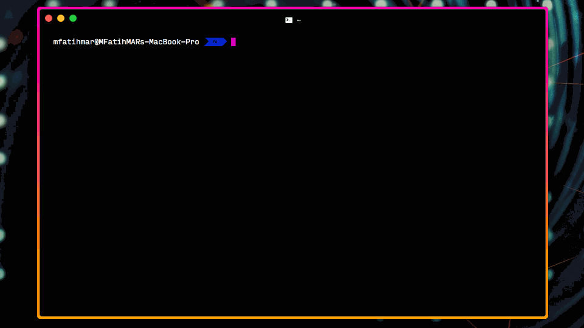

# Installation Guides

You need to install both [`Extension`](#extension) and [`Messenger`](#messenger) to have [`Socketify` API](API.md) available.

## Contents

- [Extension](#extension)
  - [Chrome](#chrome)
  - [Firefox](#firefox)
  - [Safari](#safari)
- [Messenger](#messenger)

## Extension

### Chrome

1. Go to `chrome://extensions`
2. Turn `Developer mode` switch on
3. Click `Load unpacked` button
4. Navigate and select `Chrome` extension directory
5. Note extension's `ID` because you will need it while [installing `Messenger`](#messenger)

### Firefox

1. Go to `about:debugging`
2. Click `Load Temporary Add-on` button
3. Navigate and select `manifest.json` under `Firefox` directory
4. Note `Extension ID` because you will need it while [installing `Messenger`](#messenger)

### Safari

> TODO

## Messenger

