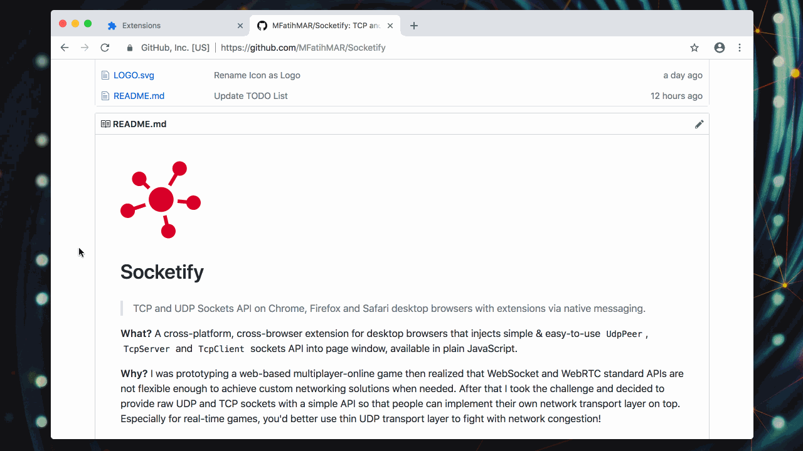
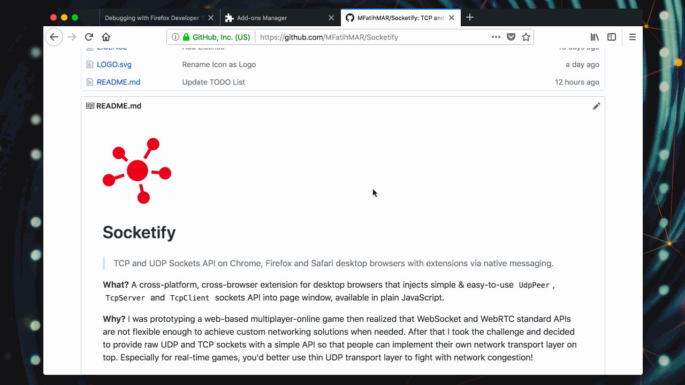

# Installation Guides

You need to install both `Extension` and `Messenger` to have `Socketify` API available.

## Contents

- [Extension](#extension)
  - [Chrome](#chrome)
  - [Firefox](#firefox)
  - [Safari](#safari)
- [Messenger](#messenger)
  - [Build](#build)
  - [Install](#install)

## Extension

### Chrome

### Firefox

### Safari

> TODO

## Messenger

### Build

### Install
